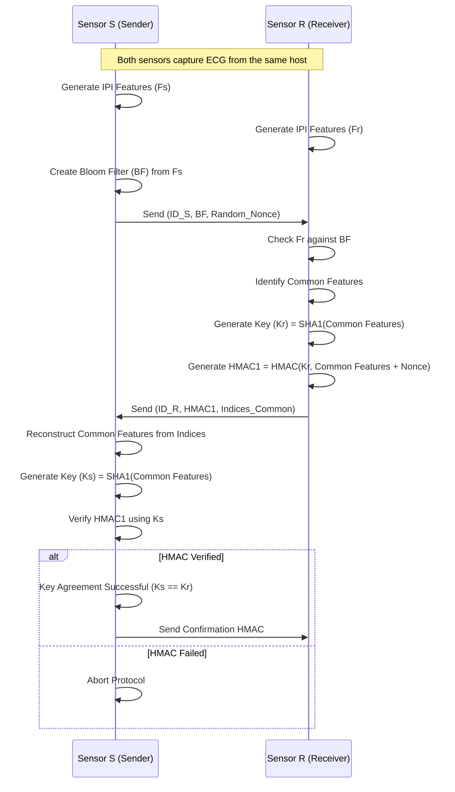

# Physio-Key-Gen: ECG-Based Key Agreement Protocol


## Project Description

**Physio-Key-Gen** is a Proof-of-Concept (PoC) implementation of a secure key agreement protocol for Wireless Body Area Networks (WBAN). It utilizes the **Inter-Pulse Interval (IPI)** derived from **Electrocardiogram (ECG)** signals as a shared source of randomness to generate cryptographic keys between two sensors.

The system employs **Bloom Filters** to efficiently reconcile the set of biometric features (IPIs) between a sender (Sensor S) and a receiver (Sensor R) without exposing the raw biometric data, ensuring both security and privacy.

## Architecture

The following diagram illustrates the key agreement flow between Sensor S and Sensor R:



## Features

*   **Biometric Feature Extraction**: Extracts Inter-Pulse Intervals (IPI) from raw ECG data using `wfdb`.
*   **Bloom Filter Implementation**: Custom Python implementation of a Bloom Filter for efficient set membership testing.
*   **Secure Key Generation**: Uses SHA-1 hashing and HMAC for secure key derivation and verification.
*   **Simulation**: Simulates the interaction between two sensors using the MIT-BIH Arrhythmia Database.

## Installation

1.  Clone the repository:
    ```bash
    git clone https://github.com/yourusername/physio-key-gen.git
    cd physio-key-gen
    ```

2.  Install the required dependencies:
    ```bash
    pip install numpy matplotlib wfdb bitarray
    ```

    *Note: You may need to download the MIT-BIH Arrhythmia Database files if they are not included or use the `wfdb` library to fetch them.*

## Usage

To run the key agreement simulation:

```bash
python KeyAgreement.py
```

This script will:
1.  Load an ECG record.
2.  Generate features for Sensor S and Sensor R (with a simulated offset/noise).
3.  Execute the key agreement protocol.
4.  Print the status of the key generation and verification steps to the console.

## Files Structure

*   `KeyAgreement.py`: Main entry point. Orchestrates the protocol between S and R.
*   `BloomFilter.py`: Class implementation of the Bloom Filter data structure.
*   `InterPulseInterval.py`: Helper functions for ECG signal processing and IPI calculation.
*   `LICENSE`: MIT License file.

## Contributing

Contributions are welcome! Please feel free to submit a Pull Request.

## License

This project is licensed under the MIT License - see the [LICENSE](LICENSE) file for details.
