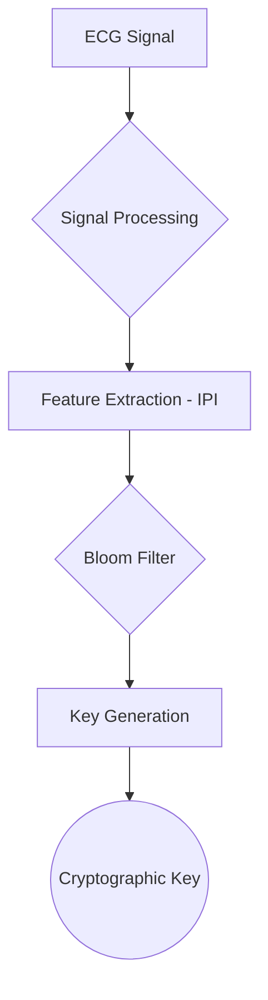

# Physio Key Gen 🔐

[](https://www.python.org/)
[](https://opensource.org/licenses/MIT)


## Overview

This project implements a cryptographic key generation system that uses physiological signals (ECG) combined with Bloom filters to create secure, reproducible keys for Wireless Body Area Networks (WBANs). This is based on the research paper "Using Bloom Filter to Generate a Physiological Signal-Based Key for Wireless Body Area Networks".

## Architecture Diagram



## How It Works

1.  **Signal Preprocessing**: The system reads ECG data from the PhysioNet database.
2.  **Feature Extraction**: It calculates the Inter-Pulse Interval (IPI) from the ECG signal to use as a biometric feature.
3.  **Bloom Filter**: The extracted features are added to a Bloom filter, a probabilistic data structure that efficiently represents the set of features.
4.  **Key Agreement**: Two devices, each with their own set of ECG features, exchange their Bloom filters to find common features.
5.  **Key Derivation**: A shared cryptographic key is generated based on the common features, using HMACs for secure key agreement.

## Installation

To run this project, you need to have Python installed, along with the following libraries:

```bash
pip install numpy matplotlib wfdb bitarray
```

## Usage

To run the main key agreement protocol, execute the following command:

```bash
python KeyAgreement.py
```

This will simulate the key generation and agreement process between two devices, printing the results to the console.

## Contributing

Contributions are welcome! If you have any suggestions or improvements, please feel free to open an issue or submit a pull request.

## License

This project is licensed under the MIT License. See the [LICENSE](LICENSE) file for details.

## Research Papers

*   Goldberger AL, Amaral LAN, Glass L, Hausdorff JM, Ivanov PCh, Mark RG, Mietus JE, Moody GB, Peng C-K, Stanley HE. PhysioBank, PhysioToolkit, and PhysioNet: Components of a New Research Resource for Complex Physiologic Signals (2003). Circulation. 101(23):e215-e220.
*   Moody GB, Mark RG. The impact of the MIT-BIH Arrhythmia Database. IEEE Eng in Med and Biol 20(3):45-50 (May-June 2001). (PMID: 11446209).
*   Using Bloom Filter to Generate a Physiological Signal-Based Key for Wireless Body Area Networks(Yao et al, 2019).
